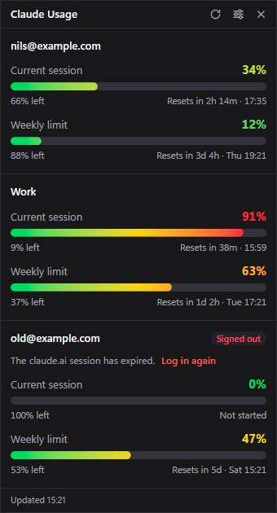
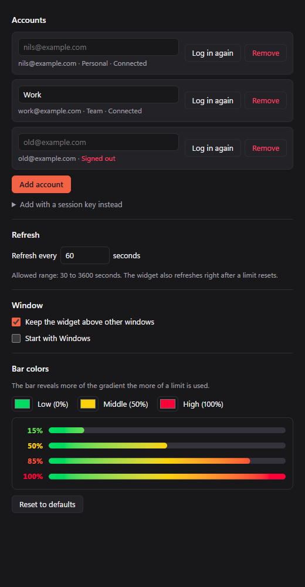

# Claude Usage Widget

A small Windows desktop widget that shows the Claude.ai usage limits of one or more accounts. For every
account it shows the current 5-hour session limit and the weekly limit as a bar, the share that has been
used, and when the limit resets.

<p align="center">
  
</p>

## Features

- Several Claude.ai accounts at the same time, each shown with its email address or a custom name.
- Two bars per account: current session (5 hours) and weekly limit, with percentage used, percentage
  left, and the time until the limit resets. A session that has not been started yet is shown as
  "Not started".
- The bar gradient runs from green through yellow to red across the full width, so the more of a limit
  is used, the further the bar reaches into the red. The three colors can be changed in the settings.
- Compact, frameless window that can be kept above other windows, remembers its position and lives in
  the system tray.
- Signing in happens on claude.ai's own login page inside the app. Signing in with a copied session key
  is available as a fallback.
- Refreshes automatically (every 60 seconds by default, and right after a limit resets), after waking
  from sleep and on demand.
- Optional start with Windows.
- Follows the Windows light or dark theme.

## Download and run

Build the portable executable yourself (see below) and start `ClaudeUsageWidget-<version>-portable.exe`.
The portable build does not need to be installed; it unpacks itself on every start, so the first
window can take a few seconds to appear.

The executable is not code-signed, so Windows SmartScreen may show a warning on the first start
("More info" > "Run anyway").

## Usage

### Adding an account

1. Click **Add account** in the widget (or in the tray menu or the settings).
2. A window with the claude.ai login page opens. Sign in as usual. With "Continue with email", claude.ai
   sends a sign-in link; if you open that link in your normal browser, it shows a code that you can
   type into the app window.
3. The window closes by itself once the sign-in worked, and the account appears in the widget.

Repeat this for every account. Each account gets its own, separate browser storage inside the app, so
the accounts do not interfere with each other or with your normal browser.

If signing in inside the app does not work (Google sometimes blocks sign-ins from embedded browsers),
use **Add with a session key instead** in the settings: sign in to claude.ai in your browser, open the
developer tools (F12), go to Application > Cookies > `https://claude.ai` and copy the value of the
`sessionKey` cookie. Treat this key like a password.

### Settings

Open the settings with the slider icon in the widget or from the tray menu.

<p align="center">
  
</p>

- **Accounts**: rename an account (an empty name shows the email address), sign in again when a
  session has expired, or remove an account.
- **Refresh**: refresh interval between 30 and 3600 seconds.
- **Window**: keep the widget above other windows, start with Windows.
- **Bar colors**: the colors at 0 %, 50 % and 100 %, with a live preview. "Reset to defaults" restores
  green, yellow and red.

### Tray

Clicking the tray icon shows or hides the widget. The tooltip lists the session and weekly usage of all
accounts. The context menu contains refresh, add account, settings and quit. Closing the widget only
hides it; use **Quit** in the tray menu to exit the app.

## What the numbers mean

The widget shows the same information as the usage page in the claude.ai settings. Claude.ai reports
the usage of each limit only as a percentage and a reset time; it does not publish absolute numbers such
as "12 of 45 messages", so the widget cannot show them either.

- **Current session**: the rolling 5-hour window. It starts with the first message after the previous
  window has ended. "Not started" means no window is running right now.
- **Weekly limit**: the usage across all models for the current week.

The data comes from the same internal endpoints that the claude.ai website uses
(`/api/organizations/{id}/usage`). They are not an official, documented API and may change without
notice. If that happens, the widget shows an error or "Not available" for the affected limits instead of
guessing numbers. "Not available" is also shown for plans that have no such limit (for example some
enterprise plans).

## Data and privacy

- The app itself only sends requests to `claude.ai`. There is no telemetry and no other server. The
  sign-in window shows claude.ai's own login page, which loads its own resources (for example the
  Google and Apple sign-in pages and Cloudflare's bot protection).
- Everything is stored locally in `%APPDATA%\Claude Usage Widget`:
  - `settings.json`: settings and the widget position.
  - `accounts.json`: email address, organization and display name per account. It contains no secrets.
  - `Partitions\acct-*`: one browser storage per account with the claude.ai cookies, including the
    session. In the packaged app, cookies are encrypted with Windows DPAPI (Electron's cookie encryption
    is switched on at build time), which ties them to your Windows user account.
- Removing an account deletes its browser storage. The claude.ai account itself is not affected.
- Development builds (`npm start`) use a separate folder, `%APPDATA%\Claude Usage Widget (dev)`, and do
  not encrypt cookies.

## Building from source

Requirements: Windows 10 or 11, Node.js 22.12 or newer (Node.js 24 recommended) and npm.

```bash
npm install
```

```bash
npm start
```

`npm start` builds the app and starts it in development mode.

```bash
npm run dist
```

`npm run dist` runs the type check and all tests, builds the app and writes the portable executable to
`release/`.

### Scripts

| Script              | Purpose                                                                  |
| ------------------- | ------------------------------------------------------------------------ |
| `npm start`         | Build and start the app in development mode.                             |
| `npm run build`     | Bundle main process, preload script and pages into `dist/` with esbuild. |
| `npm run typecheck` | Type-check the main process and the renderer with TypeScript.            |
| `npm test`          | Run all unit tests with Vitest (app and Claude Code hooks).              |
| `npm run dist`      | Type check, test, build and package the portable `.exe`.                 |
| `npm run icon`      | Regenerate the application and tray icons.                               |

### Project structure

```
src/
  main/        Electron main process: windows, tray, claude.ai client, account and settings storage
  preload/     The bridge between the pages and the main process
  renderer/    The widget and settings pages
  shared/      Code used on both sides: formatting, gradient colors, settings validation, types
  assets/      Icons that are bundled with the app
scripts/       Build script and icon generator
build/         Resources for electron-builder
docs/          Screenshots for this README
.claude/       Claude Code project hooks and their tests
```

The main process code is split into small modules with the Electron-specific parts kept thin, so that the
logic (API parsing, error handling, account handling, refresh scheduling, window placement) is covered by
unit tests without starting Electron.

### Security measures

- All pages run with context isolation and the renderer sandbox; they have no Node.js access and only
  see the small API exposed by the preload script.
- The app windows cannot navigate away from the bundled pages or open new windows. The sign-in window
  only allows popups for claude.ai and its sign-in providers (Google, Apple); other links open in the
  default browser.
- Account sessions have no permissions (camera, notifications and similar are denied, both for requests
  and for permission checks) and cannot download files.
- Requests to claude.ai time out after 20 seconds, so a broken connection cannot stop the automatic
  refresh.
- The packaged app disables `ELECTRON_RUN_AS_NODE`, `NODE_OPTIONS` and the Node.js inspector flags and
  only loads its code from the app archive.

## Claude Code hooks

This repository contains project hooks for [Claude Code](https://docs.claude.com/en/docs/claude-code) in
`.claude/`. They are active for everyone who works on the project with Claude Code:

| Hook          | Event                     | What it does                                                                                                  |
| ------------- | ------------------------- | ------------------------------------------------------------------------------------------------------------- |
| Secret guard  | Before Write/Edit         | Blocks writing anything that looks like an Anthropic session key or API token into a file.                    |
| Type check    | After editing a `.ts` file | Runs the TypeScript check and reports errors back right away.                                                |
| Test gate     | Before finishing a turn   | If source files changed, runs the type check and all tests and does not let the turn end while they fail.    |

The hook logic lives in `.claude/hooks/lib/`, the tests in `.claude/hooks/__tests__/`. They run as part
of `npm test`.

## Troubleshooting

- **"Signed out" / "The claude.ai session has expired"**: click **Log in again** in the widget or the
  settings. Sessions end after some time or when you sign out of all devices on claude.ai.
- **"claude.ai blocked the request (Cloudflare)"**: claude.ai's bot protection rejected the request.
  This happens more often behind VPNs. The widget keeps retrying; signing in again can help.
- **Google sign-in is rejected**: use email sign-in or the session key fallback described above.
- **"Start with Windows" has no effect**: it only works in the packaged app, not with `npm start`.

## License

MIT, see [LICENSE](LICENSE).
